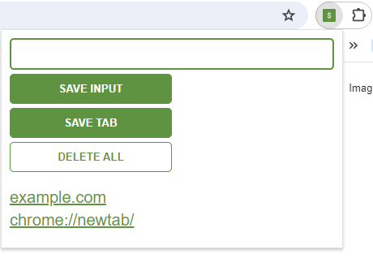

## Overview
This is a simple and neat extension for saving leads in your Chrome browser, developed in HTML, CSS and JavaScript

The project folder includes:
* Project code
* Screenshots of the application

Features:
* Interactive buttons
* Responive design
* Save your leads as input or tab in local storage
* Delete saved leads

Screenshots
* Leads tracker:

